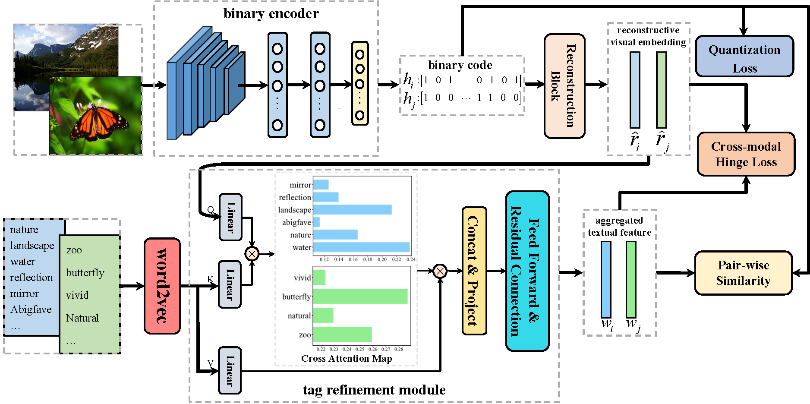

# WSDRCA

Implementation of Weakly Supervised Hashing with Reconstructive Cross-modal Attention

<center>



</center>

Steps to run the code:

1. This code is built using the following set-up
   - Ubuntu 16.04
   - Python 3.7
   - libraries in `requirements.txt`
2. Download MirFlickr and NUSWIDE datasets
3. Run `utils/MIR_preprocess.py` and `utils/NUS_preprocess.py` to preprocess MirFlickr and NUSWIDE datasets for following use in `Datasets/datasets.py` 
4. Run `WSDRCA.py` to train the model, for example 
    ```
    python WSDRCA.py \
        --bits 32 \
        --dataset 'Nuswide' \
        --margin 0.8 \
        --device '3' \
    ```
    model parameters and evaluation results will be saved in `'results/xxx.pkl'` 
